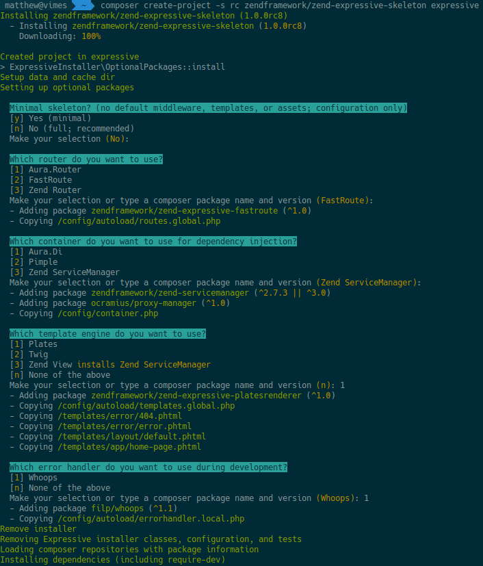

## Features

<div class="features">
    <div class="row">
        <div class="col-sm-6 col-md-4 text-center">
            

            <h3>PSR-15 Middleware</h3>

            <p>
                Create <a href="https://docs.zendframework.com/zend-stratigility/middleware/">middleware</a>
                applications, using as many layers as you want, and the architecture
                your project needs.
            </p>
        </div>

        <div class="col-sm-6 col-md-4 text-center">
            

            <h3>PSR-7 HTTP Messages</h3>

            <p>
                Built to consume <a href="https://www.php-fig.org/psr/psr-7/">PSR-7</a>!
            </p>
        </div>

        <div class="col-sm-6 col-md-4 text-center">
            

            <h3>Routing</h3>

            <p>
                Route requests to middleware using <a href="v3/features/router/intro/">the routing library of your choice</a>.
            </p>
        </div>
    </div>

    <div class="row">
        <div class="col-sm-6 col-md-4 text-center">
            

            <h3>Dependency Injection</h3>

            <p>
                Make your code flexible and robust, using the
                <a href="v3/features/container/intro/">dependency injection container of your choice</a>.
            </p>
        </div>

        <div class="col-sm-6 col-md-4 text-center">
            

            <h3>Templating</h3>

            <p>
                Create <a href="v3/features/template/intro/">templated responses</a>, using
                a variety of template engines.
            </p>
        </div>

        <div class="col-sm-6 col-md-4 text-center">
            

            <h3>Error Handling</h3>

            <p>
                <a href="v3/features/error-handling/">Handle errors gracefully</a>, using
                templated error pages, <a href="https://filp.github.io/whoops/">whoops</a>,
                or your own solution!
            </p>
        </div>
    </div>
</div>

## Get Started Now!

Installation is only a [Composer](https://getcomposer.org) command away!

```bash
$ composer create-project zendframework/zend-expressive-skeleton expressive
```

Expressive provides interfaces for routing and templating, letting _you_
choose what to use, and how you want to implement it.
    
Our unique installer allows you to select <em>your</em> choices when starting
your project!


{: .center-block }

[Learn More](v3/getting-started/quick-start.md){: .btn .btn-lg .btn-primary}

## Applications, Simplified

Write middleware:

```php
$pathMiddleware = function (
    ServerRequestInterface $request,
    RequestHandlerInterface $handler
) {
    $uri  = $request->getUri();
    $path = $uri->getPath();

    return new TextResponse('You visited ' . $path, 200, ['X-Path' => $path]);
};
```

And add it to an application:

```php
$app->get('/path', $pathMiddleware);
```

[Learn More](v3/features/application.md){: .btn .btn-lg .btn-primary}

## Learn more

* [Features overview](v3/getting-started/features.md)
* [Quick Start](v3/getting-started/quick-start.md)

Or use the sidebar menu to navigate to the section you're interested in.
